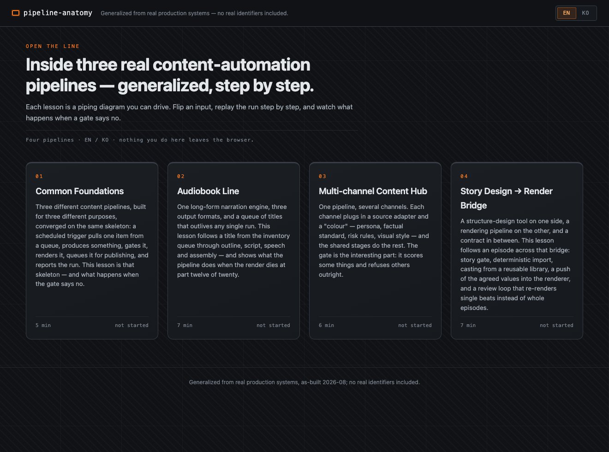
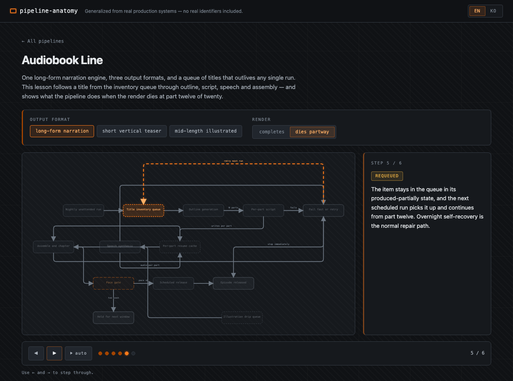

# pipeline-anatomy

[](https://github.com/oh-namgyu/pipeline-anatomy/actions/workflows/ci.yml)
[](LICENSE)

> **한글 요약** — 1인이 실제로 운영 중인 콘텐츠 자동화 파이프라인 3종(오디오북 라인·멀티채널 콘텐츠 허브·스토리 설계→렌더 브리지)의 아키텍처를, 단계별 애니메이션과 설계 결정 해설로 배우는 인터랙티브 케이스 스터디입니다. 실명·채널·수치는 전부 일반화되어 있으며, EN/KO 전환을 지원합니다. *(전체 한국어 문서: [README_KOR.md](README_KOR.md))*

An interactive case study of three content-automation pipelines that one person
actually runs. Each lesson is a piping diagram you can drive: set the inputs —
which output format, whether the render survives, whether the quality gate says
yes — and that run replays step by step across the diagram, with an explanation
for every step and a failure branch that is a real path rather than a footnote.

Four lessons: the skeleton the three pipelines share, then one lesson each for
the audiobook line, the multi-channel content hub and the story-design-to-render
bridge. Every lesson ends with the design decisions behind it — why an inventory
queue, why the gate sits before the render, why partial output is kept instead
of cleaned up — and three questions.

It is a static site: no build step, no server, no API key, no account.

---

## ⚠️ Generalized from real production systems

**Generalized from real production systems (as-built 2026-08). All identifiers,
channels, schedules and metrics are abstracted; a two-line redaction gate
(private plaintext scan + salted-HMAC CI check) enforces this.**

What that means concretely: the pipelines described here exist and run, but
nothing in this repository names them. No service name, no channel, no account,
no host, no path, no port, no run time, no view count, no revenue figure. Where
the real system has a proper noun, the lesson has a role — "the publishing
platform", "a public archive", "the scheduler". The architecture, the failure
modes and the reasoning are the parts that carry over, and they are the parts
worth reading anyway.

This is a case study of *shapes*, not a portfolio of *numbers*.

---

## Screenshots

| Home | A lesson (Audiobook Line, failing render) |
| :--- | :--- |
|  |  |

Both images are produced by `node scripts/shots.mjs`; see
[How the redaction gate works](#how-the-redaction-gate-works) for why that is a
rule rather than a habit.

---

## Lessons

| # | Lesson | Minutes | What you drive |
| :-- | :--- | :-- | :--- |
| L0 | Common Foundations | 5 | quality gate (clears / rejects) × queue (stocked / empty) |
| L1 | Audiobook Line | 7 | output format (long / short / mid-length) × render (completes / dies partway) |
| L2 | Multi-channel Content Hub | 6 | source adapter (harvested archive / curated seed) × gate (passes / risk-blocked) |
| L3 | Story Design → Render Bridge | 7 | casting (library match / new performer) × review (approved / flagged) |

Every combination of inputs has its own written scenario — that is enforced by a
schema gate, so a branch you can select but nobody wrote is a test failure, not
a surprise in production. Progress is kept in `localStorage` and never leaves the
browser.

L0 is first on purpose. The three pipelines were built years apart for
unrelated purposes and converged on the same skeleton anyway: a scheduled
trigger claims one item from a queue, produces something, gates it, renders it,
queues it for publishing, and reports the run. Reading L0 first makes the other
three lessons a study of where they *differ*.

---

## How the redaction gate works

Generalization is a claim, so it is tested. Two independent lines:

**First line — private, plaintext, not in this repository.** A deterministic
script scans a checkout against the substitution table that maps every real
name to its public role. It matches substrings, case-insensitively, after
Unicode NFC normalization and zero-width character removal, and it covers file
contents plus file names. It is not published, because publishing a list of the
names you are hiding re-exposes them. It runs before every publish, and it has
its own self-test that plants violations and asserts they are caught.

**Second line — public, in CI, in this repository.** `tests/redact.test.mjs`
runs on every push, in two halves:

- *Shape rules* need no secret and run everywhere, forks included. Filesystem
  paths, port numbers, account handles, wall-clock times and absolute URLs are
  all things a generalized model has no reason to contain, so each one is a
  finding. The URL allowlist is short, explicit and commented — standards
  endpoints, the local dev server, and this project's own public addresses.
- *A salted-HMAC denylist* catches a real name being reintroduced later.
  `tests/redact-hmac.json` holds `HMAC-SHA256(salt, term)` for every entry in
  the private table. Low-entropy names fall to a dictionary attack in seconds if
  you publish plain hashes, so the salt (`REDACT_SALT`, a CI secret) is what
  makes the file safe to commit: without it the file proves nothing about any
  particular name, and with it CI can still refuse a commit that reintroduces
  one. Without the salt this half **skips loudly** rather than passing quietly —
  a fork gets a clear message instead of a false all-clear, and the shape rules
  still run in full.

The gates run as a separate `redact` job in CI, visible on its own, so a failure
reads as "redaction" rather than "some test".

**The known limit, stated plainly.** Both lines match text. Text baked into an
image is invisible to them, and so is a name written in a form nobody registered
— a homoglyph, an unusual transliteration, a three-word variant. Those fall to
the private first line and to human review. The image case is handled by
structure instead of detection: **every committed screenshot must come from
`scripts/shots.mjs`**, which renders only the committed lesson data, so anything
it can possibly draw has already been scanned at source. A manually captured
image would carry whatever else was on screen, which is exactly the hole.

---

## Try it

**Live demo:** https://pipeline-anatomy.vercel.app

**Locally** — clone and serve the directory with anything that serves static
files:

```bash
git clone https://github.com/oh-namgyu/pipeline-anatomy.git
cd pipeline-anatomy

python3 -m http.server 6185     # then open the address it prints
# or
npx serve .
```

Opening `index.html` from the filesystem does **not** work: the app is ES
modules, which browsers refuse to load over `file://`. Any static server will
do.

---

## Development

```bash
npm ci                                  # dev dependency: @playwright/test only
npm test                                # node --test — schema gate, lesson data, redaction
npx playwright install chromium         # once
npx playwright test                     # e2e against a python3 static server
node scripts/shots.mjs                  # regenerate the screenshots above
```

Runtime dependencies: none. The page loads nothing from an external host — no
CDN script, no web font, no analytics — enforced by a `default-src 'self'` CSP
meta tag and by the same CSP as a response header in `vercel.json`.

**A lesson is a data module.** `js/lessons/*.js` export plain objects; the
engine (`js/engine/`) renders any object that passes the schema. Adding a lesson
means adding a file and one line in `js/lessons/index.js` — no engine change.
See [CONTRIBUTING.md](CONTRIBUTING.md) for the schema shape, the validator error
codes, and the rule that new content has to clear both redaction lines.

The lesson engine is ported from
[**cc-anatomy**](https://github.com/oh-namgyu/cc-anatomy), the sibling explainer
that uses the same machinery for a different subject (MIT, same author). Each
ported file records the source commit in its header so a fix on either side can
be traced to the other.

---

## Roadmap

- **L4 — Orchestrator**: the layer above these three, where one scheduler fans
  out into independent pipelines, arbitrates for a shared render machine, and
  has to decide what "the run failed" means when only one branch did.
- **Shared engine package**: the diagram, player, widget and schema modules are
  currently duplicated between this project and its sibling explainer. Extracting
  them into one package is the fix; the interim measure is the source-commit
  header on every ported file.
- **Screen-reader pass**: a live region narrating step changes, beyond the
  current keyboard and `prefers-reduced-motion` support.

---

## License

[MIT](LICENSE) © 2026 oh-namgyu.
